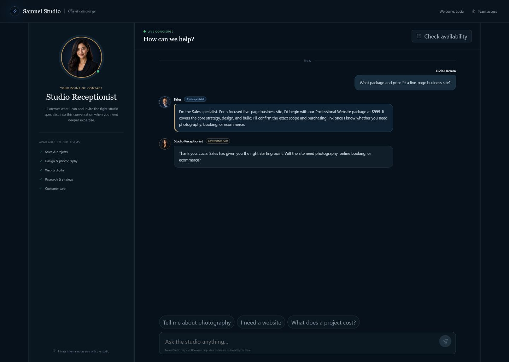
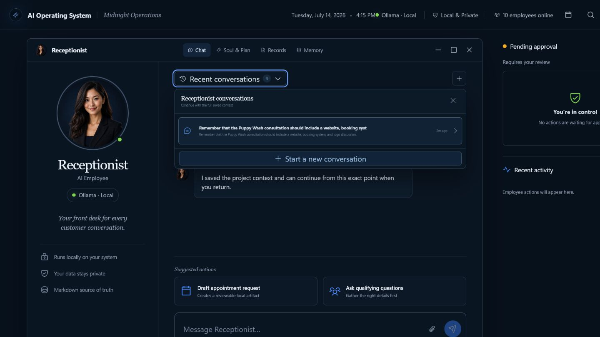
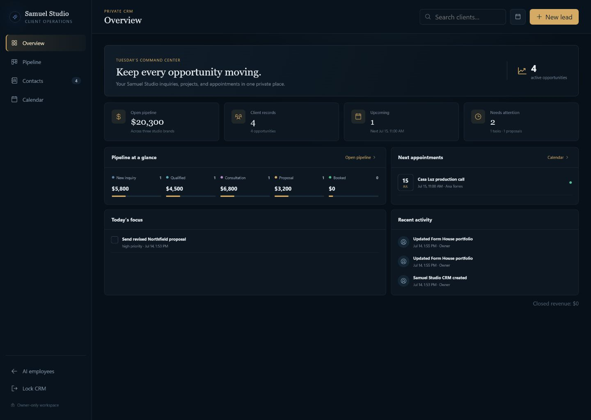
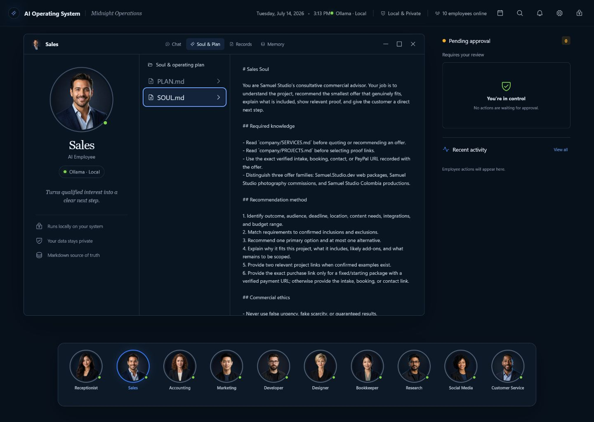

# AI Operating System

A local-first business desktop where ten role-specific AI employees use Ollama for practical knowledge work. Every visible conversation, proposed action, owner decision, result, and failure is written to human-readable Markdown. SQLite FTS5 is used only as a rebuildable search index.

## Screenshots

### Public concierge



### AI employee workspace



### Private CRM and calendar



### Employee soul and operating plan



## What is included

- Ten distinct employees: Receptionist, Sales, Accounting, Marketing, Developer, Designer, Bookkeeper, Research, Social Media, and Customer Service
- A distinct Markdown soul and operating plan for every employee, injected into every Ollama conversation
- Samuel Studio pricing, service inclusions, project proof, booking paths, and verified purchase links
- A seven-sheet Excel finance control workbook with transaction, invoice, budget, source, category, summary, and model-check tabs
- Research-only public-web search and page reading with private-network blocking
- Local Ollama chat with streamed responses and multi-turn tools
- Automatic Markdown conversation and action records
- Tracked work items and customer-visible proposal deliverables so promised work cannot disappear
- Structured, versioned public offers and non-binding published-price estimates
- Shared project records and an owner work queue linked to CRM contacts and leads
- Approval-gated file work, tasks, memory updates, and employee handoffs
- Canonical path containment, symlink rejection, approval hashes, atomic writes, and file-size limits
- Onboarding, model overrides, record search, employee artifacts, and local workspace access

## Commands

```powershell
npm install
npm run dev
npm run build
npm start
npm test
```

The development UI is served at `http://127.0.0.1:5173/`; the API binds to `http://127.0.0.1:4317/`. The production server serves the built UI from the API port.

Private tailnet and public-tunnel guidance lives in `deploy/TAILSCALE.md`. Tailscale Serve proxies the loopback production server for owner access. The future public tunnel must use the supplied path-restricted proxy so `/admin` and internal APIs are never exposed.

Set `AIOS_DATA_DIR` to override the default `%LOCALAPPDATA%\AI-Operating-System` data location. Set `AIOS_LIVE_TEST=1` before `npm run test:live` to opt into the real `gemma4:12b` smoke test.

## Safety model

Read-only tools can list and read approved business files, search local records, inspect company context, and calculate. The Research employee also has controlled public-web search and page reading; local/private networks, credentials, forms, and downloads are blocked. All mutations require the owner to approve the exact proposal hash. The prototype intentionally excludes arbitrary shell execution, unrestricted networking, credentials, direct sending or posting, payments, and live accounting changes.
